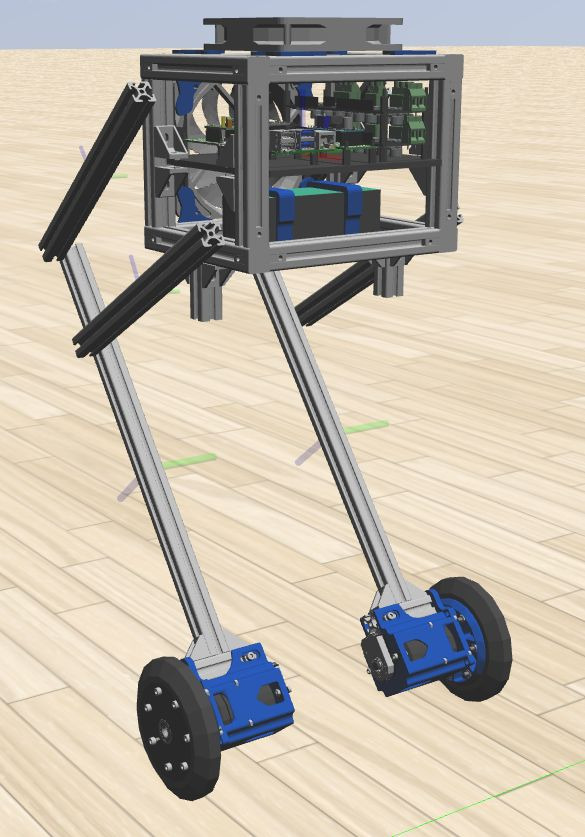

# "Control and Design of a Two-Wheeled Balancing Mobile Robot with Actuated Legs"

This folder contains some represetative files concerning my Master's thesis.
These include a compressed pdf version of the thesis (some images will not be of the highest quality or can become distorted, due to compression) and the Gazebo folder, with the used models, plugin, meshes, etc.. .

All the code, CADs etc... were not included due to space issues.

Should you need the original version of the pdf and/or some of the material, feel free to contact me.

## Synthetic description of the thesis:

- Kinematics and Dynamics modeling.

- Gazebo robot simulator (with complete SDF model of the robot) for high fidelity results.

- Custom Matlab simulator.

- Control properties analysis.

- Control design and implementation: Linear Stable Inversion+LQR state trajectory tracking, Intrinsically Stable MPC ("IS-MPC"), Task-Space tracker. All the controllers were tested and validated on both Matlab and Gazebo (Classic).

- Prototype design and implementation (with fixed leg knee).

Please also take a look at:
[WheeBBot-v1](https://github.com/AndPatr/WheeBBot-v1)
which basically is the prosecution of my thesis work.
